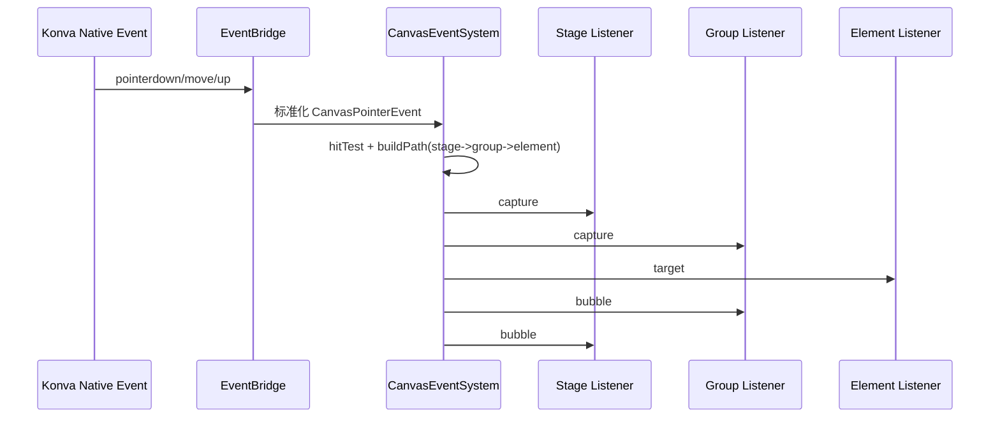
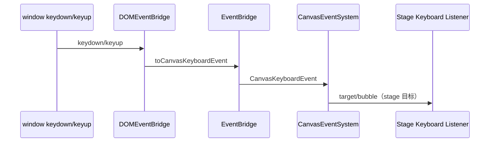

# Nebula Draft 三层架构说明（状态层-桥接层-渲染层）

## 1. 背景与目标

Nebula Draft 当前采用三层解耦结构：

- 状态层（State Layer）
- 桥接层（Bridge Layer）
- 渲染层（Render Layer）

目标是把“状态管理”“命令计算”“渲染模型更新”拆开，获得以下收益：

1. 更清晰的职责边界。
2. 更稳定的性能优化入口（diff、增量更新、命令统计）。
3. 更接近原项目 Graphite 的工程组织方式。

## 2. 分层职责总览

### 2.1 状态层（State Layer）

职责：

- 维护编辑器状态真源（history/present/future）。
- 承载业务 action（增删改查、分组、视口、撤销重做、hydrate）。
- 对外暴露统一 dispatch 接口。

关键文件：

- src/state/editorState.ts
- src/state/editorStore.ts
- src/state/indexedDbStorage.ts

状态管理实现：

- Store 库：Zustand
- Store 状态字段：history
- Store 写入入口：dispatch(action)
- Reducer 仍复用 editorReducer，保证行为一致

### 2.2 桥接层（Bridge Layer）

职责：

- 把 present 状态转换为渲染命令（create/update/delete 等）。
- 维护稳定引用，减少不必要渲染。
- 输出桥接性能指标（reconcile 耗时、命令计数）。

关键文件：

- src/bridge/canvasBridge.ts
- src/bridge/useCanvasBridge.ts
- src/types/architecture.ts

桥接输出：

- snapshot.present（稳定化后的视图状态）
- snapshot.commands（渲染命令序列）
- snapshot.elementById（稳定索引）
- metrics（reconcileMs、avg/max、create/update/delete 计数）

### 2.3 渲染层（Render Layer）

职责：

- 消费桥接层命令，维护可渲染模型（元素顺序与元素映射）。
- 将命令应用到本地模型，实现增量更新。
- 为视图层提供最终 renderElements。

关键文件：

- src/renderer/sceneRenderModel.ts
- src/components/CanvasStage.tsx
- src/components/Minimap.tsx

其中：

- sceneRenderModel.ts 负责命令应用与顺序对齐。
- CanvasStage.tsx 负责主舞台渲染与画布交互。
- Minimap.tsx 负责小地图增量重绘。

## 3. 文件映射（从入口到渲染）

1. App 入口

- src/App.tsx

2. 状态层入口

- src/state/editorStore.ts
- src/state/editorState.ts

3. 桥接层入口

- src/bridge/useCanvasBridge.ts
- src/bridge/canvasBridge.ts

4. 渲染层入口

- src/renderer/sceneRenderModel.ts
- src/components/CanvasStage.tsx
- src/components/Minimap.tsx
- src/types/architecture.ts

## 4. 运行时数据流

## 4.1 正向链路（UI -> 状态 -> 命令 -> 渲染）

1. UI 触发 action（工具栏、属性面板、快捷键、画布交互）。
2. Zustand store.dispatch(action) 调用 reducer 更新 history。
3. App 从 store 读取 history.present。
4. useCanvasBridge(present) 输出 snapshot 与 commands。
5. CanvasStage/Minimap 消费 commands 与 snapshot，执行增量渲染。

## 4.2 反向链路（渲染交互 -> 状态）

1. CanvasStage 产生交互结果（拖拽、缩放、框选、视口变化）。
2. 通过回调触发 dispatch(action)。
3. 状态层更新后，重新进入桥接与渲染链路。

## 5. 组件关系

- App
  - useEditorStore（状态层）
  - useCanvasBridge（桥接层）
  - CanvasStage（渲染层）
  - PropertiesPanel / Toolbar（DOM 交互层）

- CanvasStage
  - useSceneRenderModel（渲染层模型）
  - Minimap（渲染层子模块）

## 6. 为什么要这样分层

1. 状态层稳定：

- 业务规则集中在 reducer，不与渲染细节耦合。

2. 桥接层可观测：

- 命令和性能指标可直接用于调优与调试。

3. 渲染层可替换：

- 未来可替换 Konva 或分离 WebWorker 计算，而不动状态层。

## 7. 与原项目 Graphite 的对应关系

- 状态层：
  - Nebula: editorStore + editorState
  - Graphite: canvas-store + service 状态入口

- 桥接层：
  - Nebula: useCanvasBridge + CanvasBridge
  - Graphite: CanvasBridge（store -> RenderEngine command）

- 渲染层：
  - Nebula: sceneRenderModel + CanvasStage/Minimap
  - Graphite: RenderEngine + renderer 子模块

结论：

- 当前 Nebula 已具备原项目同类的三层骨架。
- 复杂度比 Graphite 低，但扩展方向一致。

## 8. 扩展建议

1. 状态层

- 增加 selectors（只订阅需要字段）降低 App 级重渲染。
- 增加 middleware（devtools/persist）增强可观测性。

2. 桥接层

- 引入命令优先级与批处理策略。
- 区分“交互帧命令”和“提交帧命令”。

3. 渲染层

- 进一步拆分 interaction 模块（拖拽、框选、吸附独立化）。
- 将 Minimap dirty-rect 指标上报到 bridge metrics。

## 9. 快速排障指引

- 状态异常先看：src/state/editorState.ts
- 命令异常先看：src/bridge/canvasBridge.ts
- 画面异常先看：src/renderer/sceneRenderModel.ts 和 src/components/CanvasStage.tsx
- 小地图异常先看：src/components/Minimap.tsx

## 10. 目录树视图（分层版）

```text
src/
  state/
    editorState.ts              # reducer 规则（业务状态变换）
    editorStore.ts              # Zustand store（history + dispatch）
    indexedDbStorage.ts         # 状态持久化读写

  bridge/
    canvasBridge.ts             # 状态 diff -> 渲染命令
    useCanvasBridge.ts          # 桥接 hook（快照+指标）

  renderer/
    sceneRenderModel.ts         # 命令 -> 可渲染元素模型

  types/
    editor.ts                   # 业务实体类型（BoardElement 等）
    architecture.ts             # 分层共享类型（命令/快照/指标）

  components/
    CanvasStage.tsx             # 主画布（消费渲染模型）
    Minimap.tsx                 # 小地图（消费命令增量重绘）

  App.tsx                       # 分层编排入口
```

## 11. 模块输入/输出接口表

| 模块 | 输入 | 输出 | 说明 |
| --- | --- | --- | --- |
| state/editorStore.ts | EditorAction | history, dispatch | Zustand 真源；所有写操作统一走 dispatch |
| state/editorState.ts | history + action | next history | 纯函数 reducer，承载业务规则 |
| bridge/canvasBridge.ts | present | CanvasBridgeSnapshot | 计算 create/update/delete 等命令 |
| bridge/useCanvasBridge.ts | present | CanvasBridgeFrame | 封装桥接实例与性能指标 |
| renderer/sceneRenderModel.ts | elements + commands | renderElements | 应用命令并维护稳定渲染序 |
| components/CanvasStage.tsx | renderElements + callbacks | action 回调触发 | 负责主舞台绘制和交互 |
| components/Minimap.tsx | elements + commands + viewport | 小地图帧 | 按命令做增量重绘 |

## 12. Interface/Type 抽离规范（建议）

为避免类型定义分散在业务文件中，建议按“作用域”抽离：

1. 业务实体类型放 `src/types/editor.ts`

- 例如：BoardElement、EditorPresentState、ViewportState。

2. 跨层共享类型放 `src/types/architecture.ts`

- 例如：CanvasRenderCommand、CanvasBridgeSnapshot、CanvasBridgeMetrics、CanvasBridgeFrame。

3. 仅文件内部使用的临时结构可保留在文件内

- 例如仅用于 hook 内部统计的 `BridgePerformanceAcc`。

4. 抽离判断标准

- 被 2 个及以上层级引用。
- 需要在文档或测试中明确命名。
- 未来可能成为稳定 API 边界。

5. 命名建议

- 命令型：`XxxCommand`
- 快照型：`XxxSnapshot`
- 指标型：`XxxMetrics`
- 编排输出帧：`XxxFrame`

## 13. 本次抽离结果

已完成的类型抽离：

- `CanvasRenderCommand` -> `src/types/architecture.ts`
- `CanvasBridgeSnapshot` -> `src/types/architecture.ts`
- `CanvasBridgeMetrics` -> `src/types/architecture.ts`
- `CanvasBridgeFrame` -> `src/types/architecture.ts`

现状收益：

- 桥接层和渲染层不再互相依赖具体实现文件进行 type import。
- 文档中的接口边界与代码中的类型文件一一对应。

## 14. 事件系统能力矩阵（新增）

为让 Nebula Draft 在 Canvas 场景具备接近 DOM 的事件能力，当前采用以下链路：

1. Konva/DOM 原生事件进入桥接层（EventBridge/DOMEventBridge）。
2. 统一事件对象进入 CanvasEventSystem。
3. CanvasEventSystem 执行命中检测、路径构建与 capture/target/bubble 派发。
4. CanvasStage 及后续交互模块按目标和阶段消费事件。

### 14.1 能力覆盖表

| 能力点 | 现状 | 对应实现 |
| --- | --- | --- |
| Canvas 事件桥接 | 已实现 | src/lib/EventBridge.ts |
| DOM 键盘桥接 | 已实现 | src/lib/DOMEventBridge.ts |
| 坐标转换（screen/world） | 已实现 | src/lib/Coordinate/CoordinateTransformer.ts |
| 命中检测（元素优先） | 已实现 | src/services/interaction/CanvasEventSystem.ts |
| 事件传播路径（stage/group/element） | 已实现 | src/services/interaction/CanvasEventSystem.ts |
| capture/target/bubble 派发 | 已实现 | src/services/interaction/CanvasEventSystem.ts |
| 监听器优先级 | 已实现 | src/services/interaction/CanvasEventSystem.ts |
| stopPropagation 截断传播 | 已实现 | src/lib/EventBridge.ts |
| CanvasStage 统一接线 | 已实现 | src/components/CanvasStage.tsx |

### 14.2 传播时序（Pointer）



### 14.3 传播时序（Keyboard）



### 14.4 当前限制

1. keyboard 目前默认目标为 stage，不参与图元命中路径。
2. hitTest 当前以元素 AABB 与渲染顺序为主，后续可扩展到旋转图形精确命中。
3. 事件系统已统一，但业务快捷键仍有一部分在 hook 层处理，可逐步迁移至事件系统订阅器。
